# Hackintosh Setup

Information about Hackintosh EFI setup, with Tri-boot, macOS Ventura, Kubuntu and Windows 10.

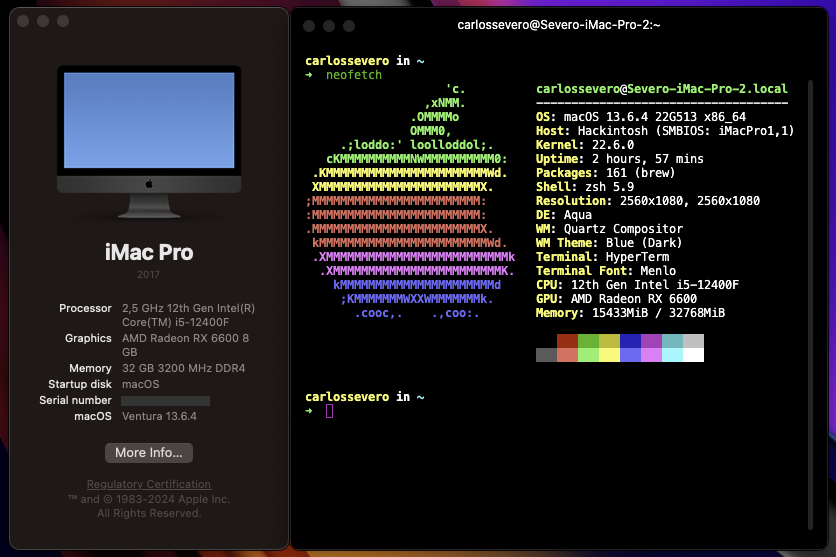

## Hardware

- CPU: Intel Core i5-12400F
- Motherboard: MSI PRO B660M-P
- Memory: Kingston Fury Beast 8 GB DDR4-3200 (4x)
- Storage: SSD 1 TB Kingston NV2 M.2 2280
- Video Card: ASRock Radeon RX 6600 8GB

## Installation

References:

- [Gabriel Luchina Live](https://www.youtube.com/watch?v=izd18LMMVrw) - To watch you need to subscribe him channel
- [OpenCore install Guide](https://dortania.github.io/OpenCore-Install-Guide/prerequisites.html#prerequisites) - Complete documentation about OC

## BIOS Settings

Boot

- Boot Configuration
  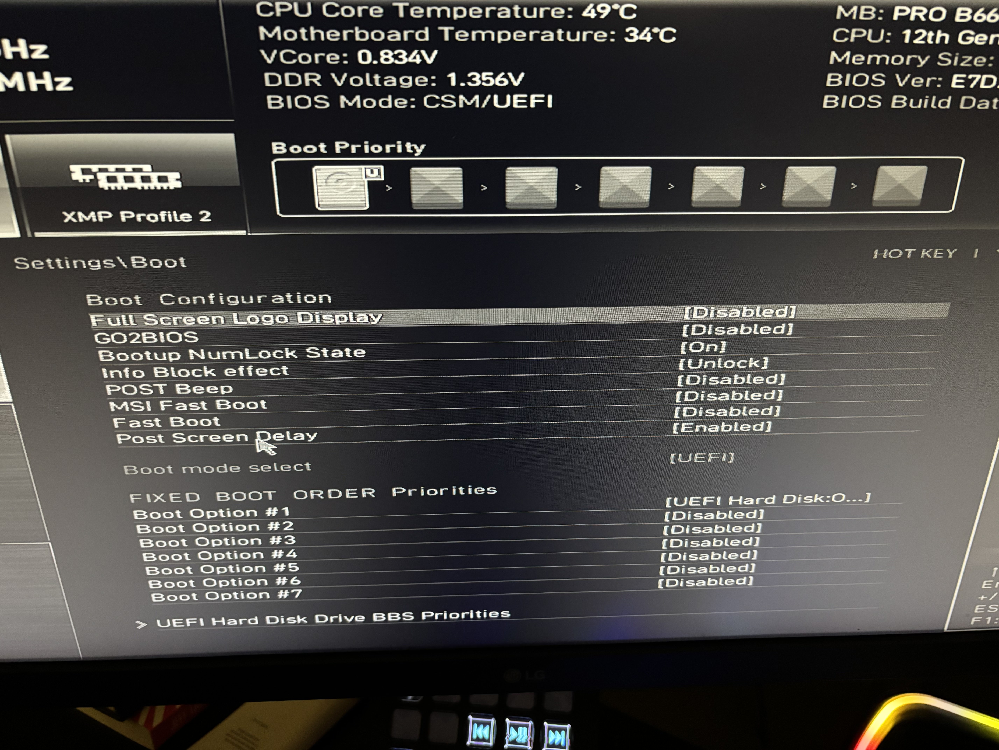

- UEFI Hard Disk Drive BBS Priorities
  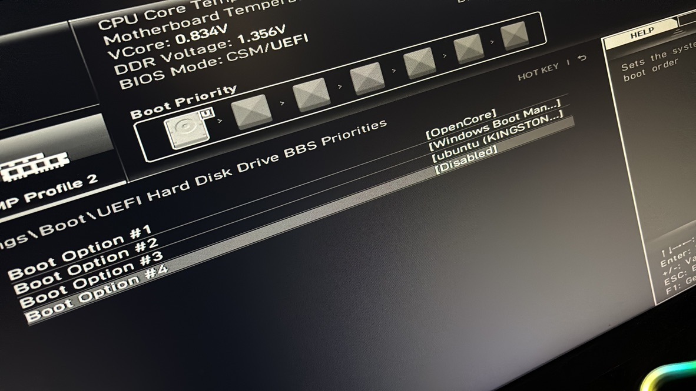

Advanced

- Power Management Setup
  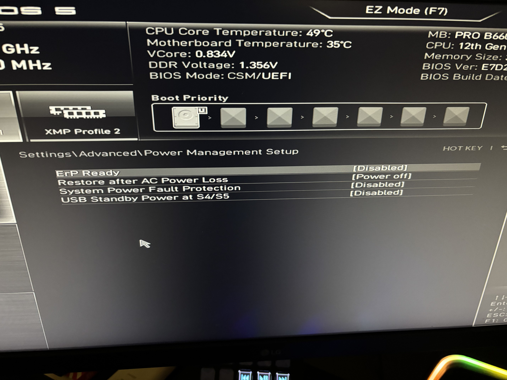

- ACPI Settings
  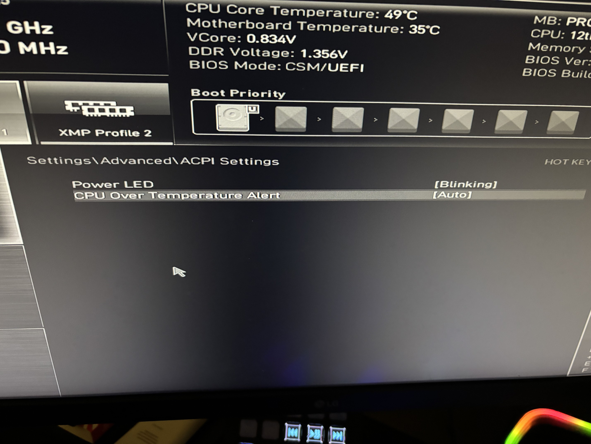

- PCIe/PCI Sub-system Settings
  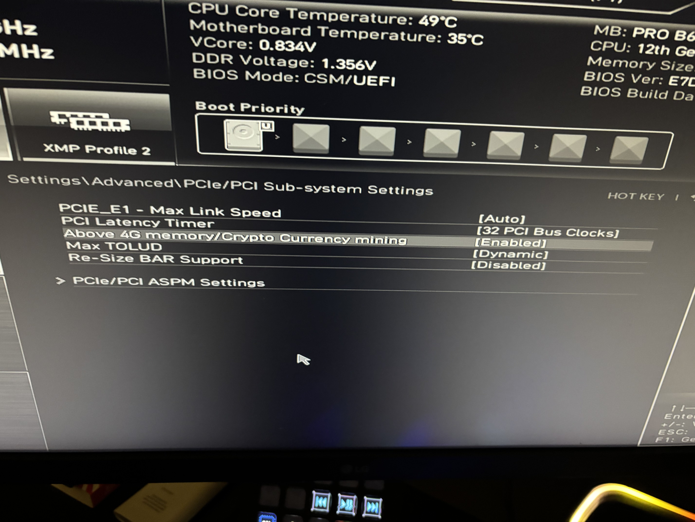

- PCIe/PCI Sub-system Settings > PCI ASPM Settings
  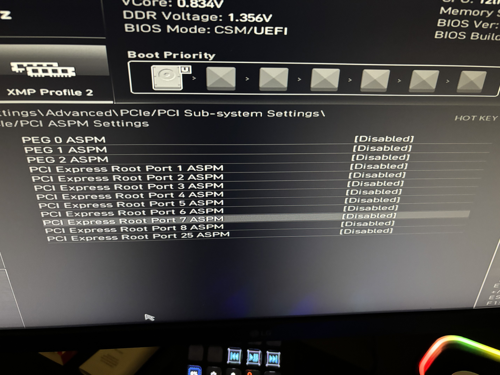

- Integrated Peripherals
  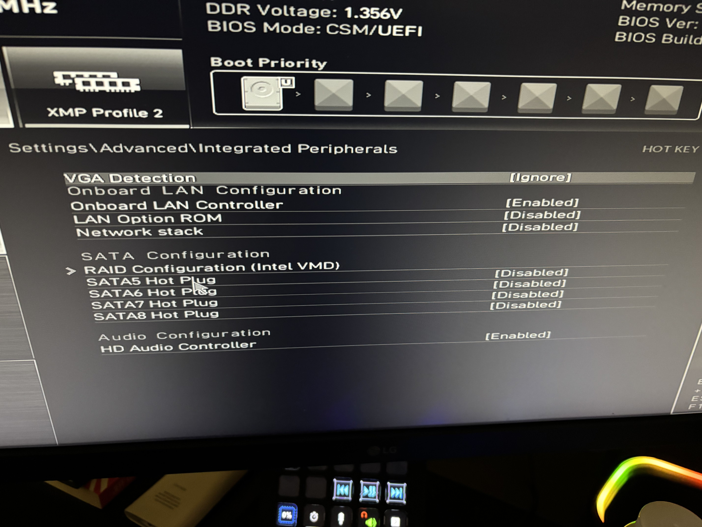

- Super IO Configuration > Serial(COM) Port 1 Configuration
  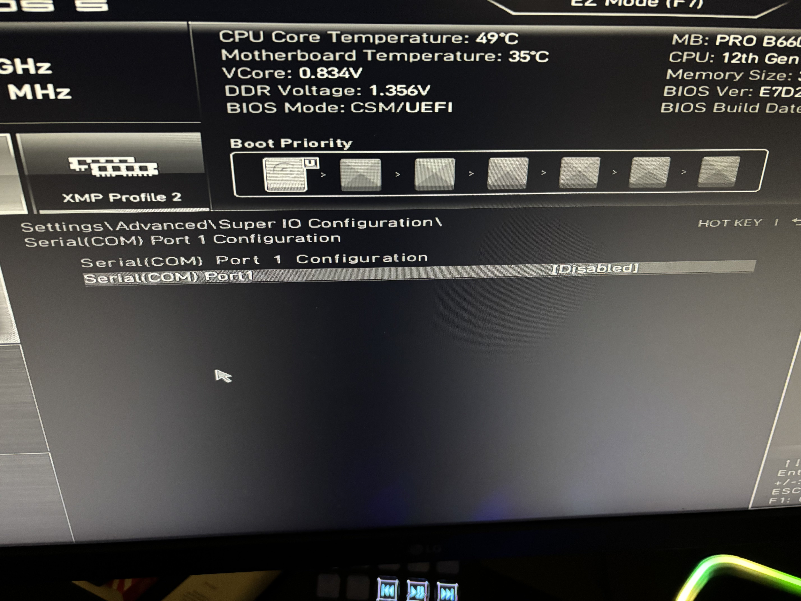

- Super IO Configuration > Parallel(LPT) Port Configuration
  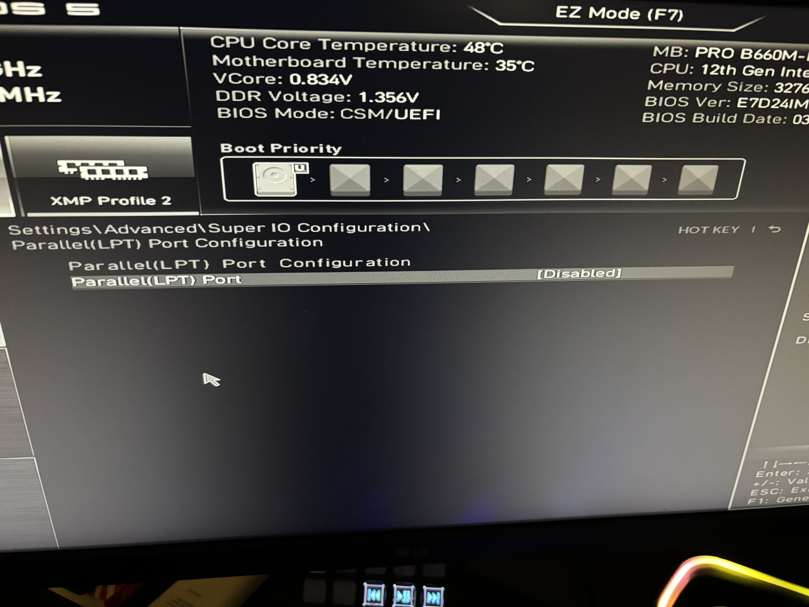

- USB Configuration
  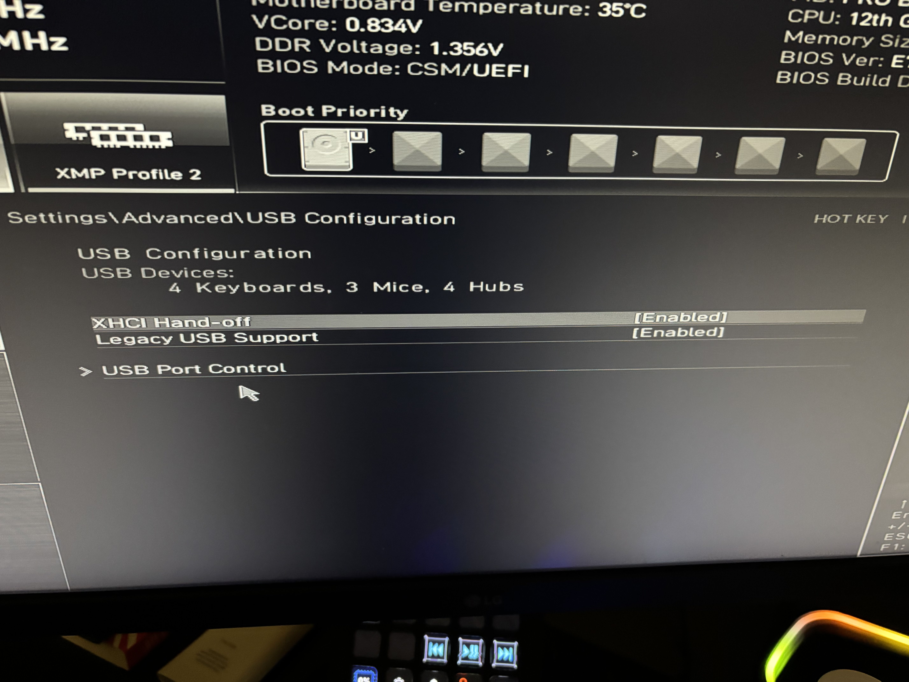

- USB Configuration > USB Port Control
  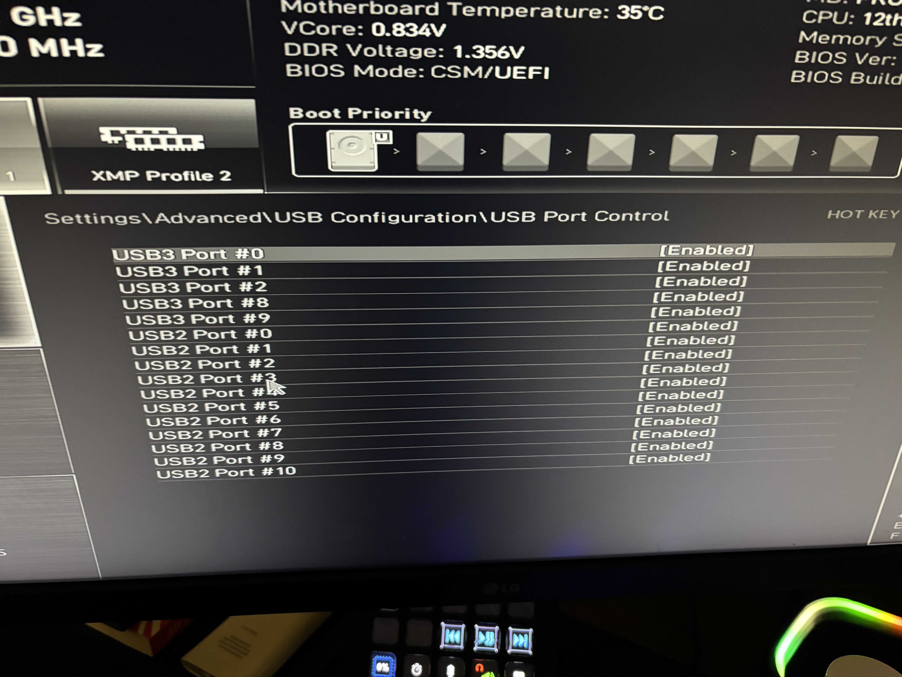

- Wake Up Event Setup
  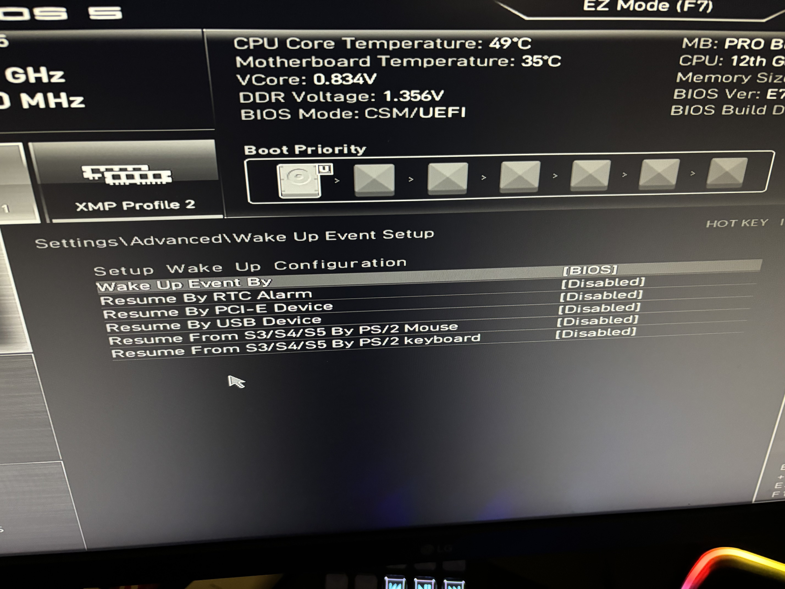

## Troubleshooting

### OpenCore boot option disappear

If it occurs because you change some partition, for example, decrease a partition to increase another one and move this unallocated space between partitions, this may cause the OC partition to disappear.

To correct it, as you already have your macOS Installed, follow these steps:

1. Access the `Settings > Boot` and as first Boot Option select your hard disk that contains your macOS installed
2. Access the `Settings > Boot > UEFI Hard Disk Drive BBS Priorities` and as first Boot Option select the **UEFI OS** and disable the others
3. Save and boot the system
4. If everything is configured correctly, it'll boot the macOS and when you access the Boot Configuration again the OC option will be available

If the 4 step not work, you'll need to boot you macOS by the USB Flash Drive and review your **EFI config.plist**
